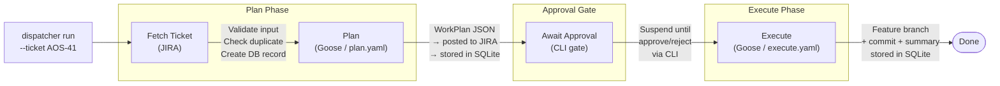

# NGB Agent Orchestrator

A local AI agent harness that turns JIRA tickets into committed code. Given a ticket key, the system plans the work using an LLM, posts the plan back to JIRA for human review, waits for approval, then executes the plan by generating code changes in a feature branch — all from the command line.

---

## How It Works



1. **Plan phase** — Goose fetches the ticket, analyses the repo, and produces a structured `WorkPlan` JSON (tasks, files affected, risks). The planner posts it as a JIRA comment so the developer can review it in context.
2. **Approval gate** — the LangGraph workflow suspends. The developer runs `dispatcher --approve-plan` or `--reject` from the terminal.
3. **Execute phase** — on approval, Goose reads the WorkPlan, creates a feature branch, implements each task, runs the test suite, and commits. A JSON execution summary (build/test status, files changed, commit SHA) is persisted to SQLite.

See [docs/architecture.md](docs/architecture.md) for a full sequence diagram and component reference.

---

## Components

| Component | Description |
|---|-----------|
| `dispatcher/run.py` | CLI entry point — orchestrates the full lifecycle |
| `orchestrator/server/` | Optional FastAPI HTTP surface for `WorkflowService` (see [docs/server.md](docs/server.md)) |
| `graph/` | LangGraph state machine — nodes, edges, approval interrupt |
| `otel/` | OpenTelemetry instrumentation — tracing, exporters, LiteLLM callback |
| `orchestrator/work_planner/recipes/plan.yaml` | Goose recipe: JIRA ticket → WorkPlan JSON |
| `orchestrator/code_generator/recipes/generate_code.yaml` | Goose recipe: WorkPlan → feature branch + commit |
| `state/` | SQLite persistence — workflows, audit log, migrations |
| `orchestrator/work_planner/schemas/work_plan_v1.json` | JSON schema contract for WorkPlan documents |
| `mcp_server/server.py` | MCP server: resolves JIRA project key → Git repo URL |
| `config/project-repo-mapping.md` | Maps JIRA project keys to target Git repository URLs |

---

## Environment Setup

### Prerequisites

- Python 3.12+
- [Goose CLI](https://github.com/block/goose) (`~/.local/bin/goose`)
- `acli` (Atlassian CLI) configured with JIRA credentials
- Azure CLI (`az`) authenticated with `az login` (or equivalent workload identity on server)
- A JIRA account on `mirandags.atlassian.net`
- Azure Key Vault containing runtime secrets for JIRA, GitHub App, and provider API keys
- (Only if running the containerised orchestrator server) A **Docker Engine**–compatible runtime providing `docker compose`. The org standardises on Docker Engine across Windows and macOS — on macOS use [Colima](https://github.com/abiosoft/colima), not Docker Desktop or Podman. See [docs/server.md](docs/server.md#container-runtime) for setup.

### Installation

```bash
# 1. Clone and enter the repo
git clone <repository-url>
cd ngb-agent-orchestrator

# 2. Create and activate virtual environment
python3 -m venv venv
source venv/bin/activate

# 3. Install dependencies and register the CLI
pip install -r requirements.txt
pip install -e .                      # registers the `dispatcher` CLI command
pip install -r requirements-dev.txt   # for development (pre-commit, pytest, etc.)

# 4. Authenticate Azure CLI (required before setup-env --env)
az login

# 5. Set up environment variables
cp .env.example .env
# Edit .env minimally (for example AZURE_KEYVAULT_NAME if needed)

# 5.1 Fetch secrets from Azure Key Vault and write them into .env
./setup-env.sh --env

# 6. (Recommended) Auto-load .env with direnv
brew install direnv
echo 'eval "$(direnv hook zsh)"' >> ~/.zshrc  # or ~/.bashrc
direnv allow .

# 7. Install pre-commit hooks
pre-commit install

# 8. Verify setup
dispatcher --help
```

### Registering the MCP Server (Agent Harness)

The `mcp_server/server.py` tool lets Goose resolve a JIRA project key to its target Git repository URL. It must be registered in your local Goose config — this is a **one-time per-machine setup** and is not stored in the repo.

Add the following block to `~/.config/goose/config.yaml` under the `extensions:` key:

```yaml
extensions:
  agent-harness:
    enabled: true
    type: stdio
    name: agent-harness
    description: Resolves a JIRA project key to its Git repository URL using config/project-repo-mapping.md
    display_name: Agent Harness
    cmd: /path/to/ngb-agent-orchestrator/venv/bin/python
    args:
      - -m
      - mcp_server.server
    env_keys: []
    bundled: false
```

Replace `/path/to/ngb-agent-orchestrator` with the absolute path to your local clone. Restart Goose after editing.

To add a new project, append a row to [config/project-repo-mapping.md](config/project-repo-mapping.md) — no server restart is needed as the file is read on every tool call.

See [docs/mcp-server.md](docs/mcp-server.md) for full details including how to run the server standalone for testing.

### Running Your First Workflow

```bash
# Run the full pipeline for a JIRA ticket
dispatcher --ticket AOS-41

# After reviewing the WorkPlan comment on JIRA, approve or reject:
dispatcher --approve-plan --ticket AOS-41
dispatcher --reject  --ticket AOS-41 --reason "scope too broad"

# Resume a failed workflow from the node that failed
dispatcher --retry --ticket AOS-41

# List all workflows (optionally filter by ticket)
dispatcher --list
dispatcher --list --ticket AOS-41

# Show which nodes executed and in what order
dispatcher --history --ticket AOS-41
dispatcher --history --workflow-id <uuid>

# Launch the interactive TUI for keyboard-driven workflow management
dispatcher --tui

# Clear all workflows and checkpoints from the local database
dispatcher --clear-db
```

### Running the Orchestrator HTTP Server (optional)

By default, the dispatcher runs the orchestrator **in-process** — no server required. If you want to share one orchestrator across multiple dispatchers, IDEs, or the TUI, start the FastAPI server and point the dispatcher at it.

```bash
# Option 1: container via orchestrator-server-ctl (recommended for local dev)
orchestrator-server-ctl start          # docker compose up -d --build; survives terminal close
orchestrator-server-ctl status         # container state + /healthz probe
orchestrator-server-ctl logs -f        # follow container logs
orchestrator-server-ctl stop           # docker compose down

# Option 2: console script in the foreground (uses .env from your shell)
orchestrator-server

# Option 3: uvicorn directly (handy for --reload during dev)
uvicorn orchestrator.server.app:app --host 0.0.0.0 --port 8080

# Option 4: docker compose directly (same thing orchestrator-server-ctl wraps)
docker compose up --build

# Verify
curl http://localhost:8080/healthz   # → {"status":"ok"}
```

The `orchestrator-server-ctl` helper lives in [`bin/`](bin/orchestrator-server-ctl), is put on `PATH` by direnv (see [`.envrc`](.envrc)), and drives the container via `docker compose` (config lives in [`docker-compose.yml`](docker-compose.yml), not in the script). Requires a `docker compose` provider — `./setup-env.sh --docker` checks for and reports how to install one.

Then route the CLI through the server by setting two env vars (typically in `.env`):

```bash
ORCHESTRATOR_MODE=remote
ORCHESTRATOR_URL=http://localhost:8080
# ORCHESTRATOR_TOKEN=<bearer>   # required when ORCHESTRATOR_API_TOKEN is set on the server
```

See [docs/server.md](docs/server.md) for the full run story (endpoints, auth, SSE, Docker) and [docs/configuration.md](docs/configuration.md#dispatcher--orchestrator-transport) for the env-var contract.

### Quick-reference aliases

When `.envrc` is active (direnv), the following shorthand aliases are available:

| Alias | Maps to | Description |
|---|---|---|
| `orc-build` | `orchestrator-server-ctl start` | Build and start the container |
| `orc-up` | `orchestrator-server-ctl start` | Same as `orc-build` |
| `orc-down` | `orchestrator-server-ctl stop` | Stop and remove the container |
| `orc-status` | `orchestrator-server-ctl status` | Show container state + health |
| `orc-logs` | `orchestrator-server-ctl logs` | Tail logs (pass `-f` to follow) |
| `orc-restart` | `orchestrator-server-ctl restart` | Stop then start the container |

All aliases forward extra arguments to the underlying command (e.g. `orc-logs -f`).

---

## Documentation

| Topic | File |
|---|---|
| Architecture & flow diagram | [docs/architecture.md](docs/architecture.md) |
| Environment variables & credentials | [docs/configuration.md](docs/configuration.md) |
| Running workflows, approval, lifecycle | [docs/workflows.md](docs/workflows.md) |
| Goose recipes (plan & execute) | [docs/recipes.md](docs/recipes.md) |
| SQLite state store & migrations | [docs/state-store.md](docs/state-store.md) |
| MCP server setup & repo mapping | [docs/mcp-server.md](docs/mcp-server.md) |
| Orchestrator HTTP server (FastAPI) | [docs/server.md](docs/server.md) |
| Development guide (tests, pre-commit, contributing) | [docs/development.md](docs/development.md) |

---

## References

- [Confluence: Agent Harness](https://mirandags.atlassian.net/wiki/spaces/AOS/pages/2752553)
- [Confluence: Agentic Workflow Architecture](https://mirandags.atlassian.net/wiki/spaces/AOS/pages/2850817)
