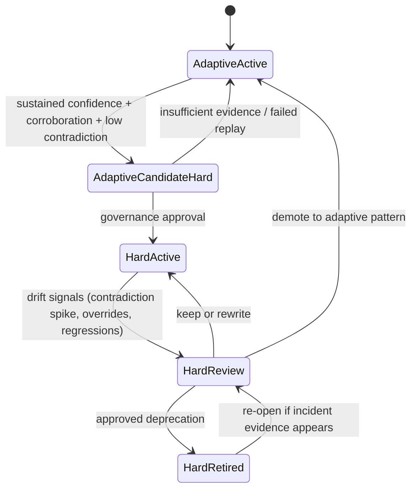

# ACE — Integration Safety Model: Quality Gates, Rollback, and Blast-Radius Control

## Why safety is a first-class layer

ACE makes context adaptive. That improves performance over time, but it also introduces a new failure mode: the system can learn the wrong lesson and then amplify it across future runs. In a static prompt world, mistakes are local and mostly manual. In an adaptive context world, mistakes can become systemic.

This topic exists to keep learning velocity high without allowing context poisoning. The core design principle is simple: adaptive context can optimize behavior, but it cannot redefine policy boundaries.

## Minimal mental model

Use two context classes at runtime:

- **Hard context (authoritative, non-ACE):** security policies, compliance constraints, permission boundaries, and non-negotiable architectural invariants.
- **Adaptive context (ACE-managed):** learned patterns, failure avoidances, task-specific heuristics, and review-derived improvements.

Precedence must be explicit:

1. Hard constraints win.
2. Stable baseline guidance comes next.
3. ACE-injected context is last and only if non-conflicting.

This ordering gives you safe optimization: ACE can improve output quality inside the boundaries, but cannot move the boundaries.

## Safety mechanism: gated lifecycle + runtime guardrails

Safety is a layered control system, not a single filter.

- **Input safety:** only structured, provenance-backed evidence enters reflection.
- **Promotion safety:** staged items need corroboration/thresholds before becoming active.
- **Retrieval safety:** scope matching and confidence tiering prevent over-broad injection.
- **Runtime safety:** planner/code generator policy checks reject context that conflicts with hard constraints.

If any layer is uncertain, fail closed by demoting confidence, scoping narrower, or withholding injection.

## Quality gates before promotion

A practical gate set for v1:

- **Provenance gate:** no traceability, no promotion.
- **Consistency gate:** unresolved contradiction with stronger active item blocks promotion.
- **Generalization gate:** one-off specifics must remain narrowly scoped or staged.
- **Freshness gate:** stale evidence reduces confidence or blocks activation.
- **Harm gate:** anything recommending bypass of tests/reviews/security controls is rejected.

If you can keep only one gate in v1, promotion safety is the correct choice because promoted bad context has the highest blast radius.

## Rollout and rollback

Treat context changes like deploys.

- **Rollout stages:** staged-only -> shadow retrieval -> canary injection -> gradual expansion -> full activation.
- **Soft rollback:** immediate status demotion (suspend/deprecate) removes runtime effect while preserving audit history.
- **Hard rollback package:** disable a cluster of items tied to a bad reflector/curator version or evidence source.

Signals such as contradiction spikes and PR rejection clusters should trigger soft rollback plus investigation. They are strong warnings, not automatic proof that the item is invalid.

## Planner vs code generator canary placement

Canary placement depends on item type:

- Broad strategic guidance belongs in planner-time canaries.
- Narrow procedural guidance may be safer as code-generation-time canaries.

This avoids over-indexing on a single insertion point and keeps canaries aligned with where each item actually affects behavior.

## Bi-directional governance: adaptive <-> hard

The system should support promotion and deprecation between adaptive and hard context.

- **Adaptive -> Hard:** repeated high-quality evidence can graduate a learned pattern into enforceable policy.
- **Hard -> Review/Retire:** adaptive telemetry can flag stale or harmful hard rules for governance review.

Important boundary: adaptive context may trigger policy review, but cannot directly remove hard constraints.

## Tradeoffs

- More gates reduce poisoning risk but slow learning throughput.
- Faster promotion increases adaptability but raises rollback frequency.
- Strict hard-context governance improves safety but can delay necessary policy evolution.

A healthy system accepts slower unsafe changes in exchange for stable long-term reliability.

## Context loading references

### Papers and web docs
- ACE paper (HTML): https://arxiv.org/html/2510.04618v3
- GitHub webhook events and payloads: https://docs.github.com/en/webhooks/webhook-events-and-payloads

### Implementation repositories
- SDK-oriented ACE implementation: https://github.com/kayba-ai/agentic-context-engine
- Reference ACE implementation: https://github.com/ace-agent/ace

### Local files and code anchors
- `ace-context-loading-sources.md`
- `00-ace-primer-roadmap.md`
- `08-ace-orchestrator-injection-points.md`
- `09-ace-orchestrator-learning-pipeline.md`
- `11-ace-orchestrator-data-model.md`
- `/Users/romulo/Projects/ngb-agent-orchestrator/orchestrator/work_planner/nodes/generate_plan.py`
- `/Users/romulo/Projects/ngb-agent-orchestrator/orchestrator/code_generator/nodes/run_goose.py`
- `/Users/romulo/Projects/ngb-agent-orchestrator/state/sqlite_workflow_repository.py`
