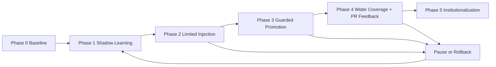
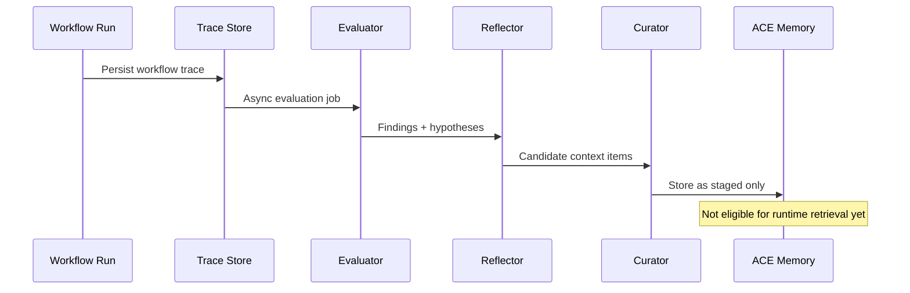
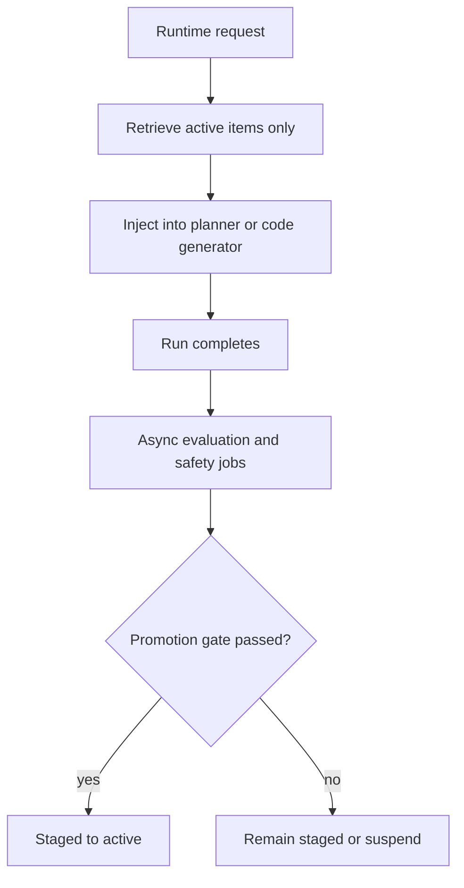
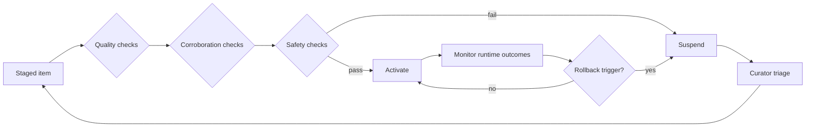
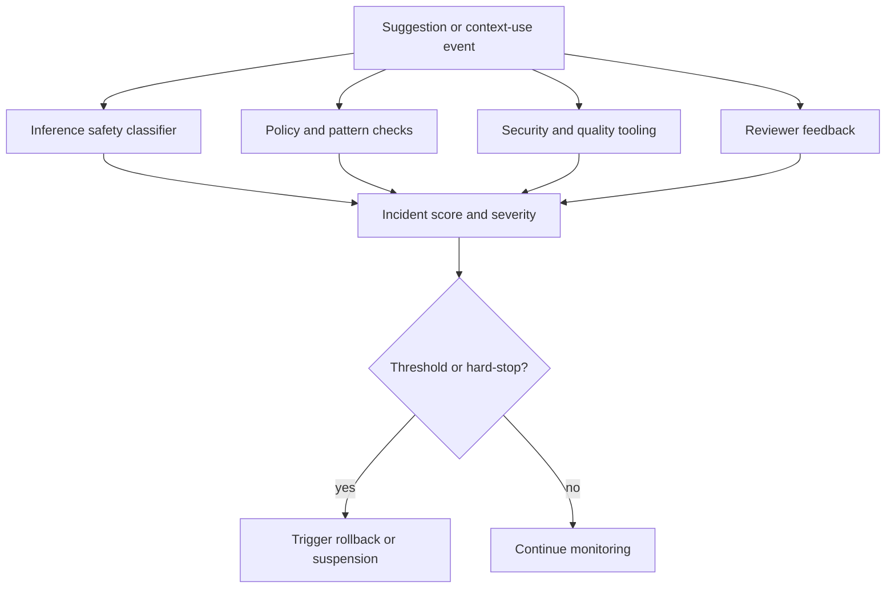
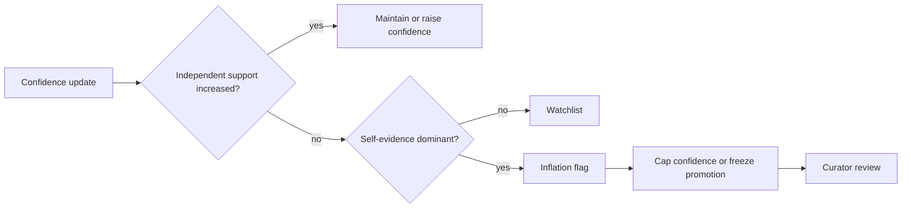
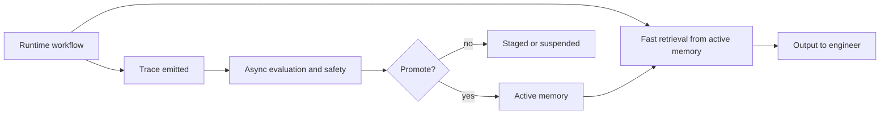

# ACE - End-to-End Rollout Blueprint: Phased Adoption Plan for Your Framework

## Why this topic exists

ACE can improve rapidly, but it can also amplify weak or harmful signals if introduced too aggressively. The rollout blueprint exists to control that risk: you increase capability only when evidence says quality and safety are stable.

The objective is not just "enable ACE." The objective is to preserve engineer trust while improving delivery outcomes.

## Minimal mental model

Treat rollout as a gated state machine:

1. Learn safely without impact.
2. Inject in narrow lanes with guardrails.
3. Promote only corroborated items.
4. Expand by segment, not globally.
5. Institutionalize ownership and operating rhythms.

## Phase 0 - Baseline and segmentation

### Problem

If you do not establish a baseline, later gains can be confounded by easier tickets, reviewer drift, or release pressure.

### Mechanism

1. Freeze a baseline window (for example, 4-8 weeks).
2. Segment by task family, code area, and reviewer group.
3. Record the same metrics you will use post-rollout.
4. Capture variance, not only averages.

### Tradeoff

Longer baseline windows increase confidence but delay rollout.

### Clarification from discussion

Baseline is a "before ACE behavior" reference. It is not a set of context items. Shadow learning (Phase 1) is where context items are created without influencing runtime decisions.

## Phase 1 - Shadow learning only (no runtime injection)

### Problem

You need to validate learning quality before it can influence planner or code generator behavior.

### Mechanism

1. Run evaluator, reflector, and curator asynchronously over traces.
2. Create staged context items with confidence and provenance.
3. Measure contradiction emergence, deduplication pressure, and promotion readiness.

### Tradeoff

No immediate runtime benefit, but this is the safest tuning phase.

## Phase 2 - Limited injection in low-risk lanes

### Problem

First production exposure is where retrieval relevance and prompt-fit issues emerge.

### Mechanism

1. Inject only in low-risk task segments.
2. Keep a strict allowlist of context item types.
3. Log explicit utilization evidence (item -> decision mapping).
4. Keep learning and safety checks asynchronous.

### Tradeoff

Slower upside than broad rollout, but much cleaner causal signal.

### Practical gate (from discussion)

Move to Phase 3 only when:

1. Context utilization rises above noise floor.
2. No meaningful guardrail degradation is observed.

## Phase 3 - Guarded promotion and rollback controls

### Problem

If promotion is too strict, ACE stalls. If too loose, weak signals become policy.

### Mechanism

1. Promotion requires corroboration and opportunity-adjusted evidence.
2. Rollback supports item-level, scope-level, and segment-level suspension.
3. Safe mode disables learned-item injection in affected segments.

### Tradeoff

More controls reduce bad promotions but increase operational complexity.

## Harmful suggestion incident detection as rollback input

### Problem

Inference-only safety classification is too brittle and hard to audit.

### Mechanism

Use multi-signal detection:

1. Inference classifier over suggestion event.
2. Deterministic policy and deny-pattern checks.
3. Tooling signals (security scans, tests, policy-as-code).
4. Human feedback signals (review flags, overrides).

Combine into incident scoring, with hard-stop rules for critical classes.

### Tradeoff

Higher implementation overhead, much lower escape risk.

## Confidence inflation without corroboration

### Problem

Confidence can rise from repeated self-reinforcement even when independent evidence is flat.

### Mechanism

Track confidence with provenance-aware support:

- confidence C
- independent corroboration S_ind
- eligible opportunities N_elig
- corroboration ratio R = S_ind / N_elig

Flag inflation when confidence rises while independent support does not.

### Tradeoff

Simple thresholds are heuristic and should be treated as starting points, not scientific truth.

### Epistemology note from discussion

The rule structure is science-grounded (calibration and independent evidence principles), but concrete thresholds must be empirically calibrated on your traces using labeling, ROC or PR analysis, and sensitivity tests.

## Phase 4 - PR feedback integration and wider segment coverage

### Problem

High-quality corrective signals appear in code review, but this signal is noisy and heterogeneous.

### Mechanism

1. Normalize PR comments and reviews into evidence events.
2. Deduplicate by semantic key and artifact scope.
3. Expand rollout by segment once safety and utilization remain stable.

### Tradeoff

Coverage grows, but operational variance increases and requires stronger segmentation discipline.

## Phase 5 - Institutionalization

### Problem

Without durable ownership and cadence, context quality decays.

### Mechanism

1. Assign product, technical, and governance ownership.
2. Run weekly quality review, biweekly policy tuning, monthly schema audit.
3. Keep a documented rollback and incident response runbook.

### Tradeoff

Governance overhead increases, but long-term reliability and trust improve.

## Why async gating is the preferred architecture

From an implementation standpoint, the safest default is:

1. Runtime path: retrieve from active items only (fast path).
2. Async path: evaluate, detect risk, and decide promotion.
3. Gate: staged-to-active promotion is the control point.

This keeps workflow latency low while preserving safety.

## Common failure modes and mitigations

1. Premature broad rollout
Mitigation: segment-first canary and hard expansion gates.

2. Heuristic lock-in
Mitigation: periodically recalibrate thresholds with labeled trace data.

3. Metric gaming
Mitigation: pair leading metrics with lagging and guardrail metrics.

4. Slow rollback response
Mitigation: pre-wired item, scope, and segment suspension controls.

## Topic summary

A successful ACE rollout is not one big launch. It is a controlled sequence where each phase earns progression through measurable evidence. The practical shape is: baseline, shadow learning, narrow injection, guarded promotion, broader coverage, and institutionalized operations.

## Context loading references

### Papers and web docs
- ACE paper (HTML): https://arxiv.org/html/2510.04618v3
- ACE paper (abstract): https://arxiv.org/abs/2510.04618
- LangGraph docs: https://langchain-ai.github.io/langgraph/
- GitHub pull request reviews API: https://docs.github.com/en/rest/pulls/reviews
- GitHub webhook events and payloads: https://docs.github.com/en/webhooks/webhook-events-and-payloads

### Implementation repositories
- SDK-oriented ACE implementation: https://github.com/kayba-ai/agentic-context-engine
- Reference ACE implementation: https://github.com/ace-agent/ace

### Local files and code anchors
- ace-context-loading-sources.md
- 00-ace-primer-roadmap.md
- 12-ace-orchestrator-guardrails.md
- 13-ace-measurement.md
- /Users/romulo/Projects/ngb-agent-orchestrator/orchestrator/work_planner/nodes/generate_plan.py
- /Users/romulo/Projects/ngb-agent-orchestrator/orchestrator/code_generator/nodes/run_goose.py
- /Users/romulo/Projects/ngb-agent-orchestrator/state/state_store.py
- /Users/romulo/Projects/ngb-agent-orchestrator/dispatcher/work_plan_formatter.py
