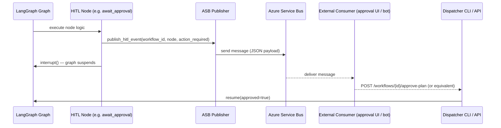

# Architectural Decision Record (ADR)

<!-- Template-Version: 1.0.0 -->

## Issue

The NGB Agent Orchestrator uses LangGraph `interrupt()` to suspend graph execution at Human-in-the-Loop (HITL) nodes — currently `await_approval`, with additional HITL checkpoints (e.g., clarification, PR review) planned. This mechanism is local and process-scoped: when the orchestrator runs in distributed mode (`ORCHESTRATOR_MODE=remote`), there is no reliable way for external systems, operators, or downstream automation to be notified in real time that a workflow is waiting for a human decision.

Without a durable, decoupled notification channel, operators must poll the REST API or monitor SSE streams continuously to detect suspended workflows. This is operationally fragile, does not scale across multiple running workflows, and cannot trigger external approval workflows (e.g., ticketing systems, Slack bots, mobile notifications, or audit pipelines).

## Decision

For every LangGraph node in the orchestrator graph that requires human-in-the-loop interaction, publish a structured message to an Azure Service Bus queue or topic immediately before the graph suspends via `interrupt()`. The message payload identifies the workflow, the HITL node type, the required action, and a correlation ID so consumers can route and respond appropriately.

## Status

**NOT STARTED** / IN PROGRESS / COMPLETE

## Impact

**HIGH** / MEDIUM / LOW

## Approver

Kedar, Enterprise Architect

## Contributors

<!-- Name(s) of contributors involved in this decision. -->

## Group

AI Platform

## Completion Date

<!-- YYYY-MM-DD -->

## References

<!-- See 🌟 References section below -->

---

## 📘 Assumptions or Constraints

### Assumptions

- The orchestrator deployment environment has network access to an Azure Service Bus namespace.
- Azure Service Bus credentials (connection string or managed identity) are provided via environment variables and are not hardcoded.
- The HITL node set is currently: `await_approval`. Additional nodes (e.g., `await_clarification`, `await_pr_review`) will be added as the product evolves; the publishing pattern must be reusable across all of them.
- Consumers of the ASB messages (approval UIs, Slack bots, external ticketing integrations) are out of scope for this ADR and will be defined separately.
- Message delivery guarantees of "at least once" are acceptable; idempotent consumers are the responsibility of downstream subscribers.
- The existing `WorkflowService` / `LocalWorkflowService` boundary remains the authoritative state store; ASB messages are notifications only and do not replace SQLite as the source of truth.

### Constraints

- Publishing to ASB must not block or delay graph execution. If the publish call fails, the failure must be logged and surfaced as a non-fatal error — the HITL interrupt must still fire.
- The solution must work in both `ORCHESTRATOR_MODE=local` (single-process dev) and `ORCHESTRATOR_MODE=remote` (distributed). In `local` mode, publishing can be disabled via a feature flag / missing env var without breaking the workflow.
- Message schemas must be versioned so consumers can evolve independently of the orchestrator.

---

## Diagram

---

## 🌈 Positions (Options Considered)

|  | Option 1: Azure Service Bus Queue/Topic | Option 2: Polling the REST API / SSE | Option 3: Azure Event Grid |
|---|---|---|---|
| **Description** | Publish a structured JSON message to an ASB queue or topic at each HITL node boundary before `interrupt()` fires. Consumers subscribe and react asynchronously. | Consumers poll `GET /workflows` or subscribe to the SSE `/events` stream, filtering for `status=PENDING_APPROVAL` (or similar) events. No new infrastructure component required. | Publish CloudEvents to Azure Event Grid at each HITL boundary. Consumers subscribe via Event Grid subscriptions. Provides fine-grained fan-out and filtering rules. |
| **Pros and Cons** | ✅ Push-based — consumers react immediately without polling. ✅ Durable — messages survive consumer restarts (queue retention). ✅ Decouples orchestrator from consumers; multiple independent consumers via topic subscriptions. ✅ Dead-letter queue for failed deliveries aids observability. ✅ Already in EQ Bank's Azure footprint. ❌ Requires ASB namespace provisioning and credential management. ❌ Adds a network dependency at the HITL boundary. | ✅ Zero new infrastructure — the REST/SSE surface already exists. ✅ Works in `local` mode without any cloud dependency. ❌ Consumers must implement polling or maintain a persistent SSE connection. ❌ SSE connections drop on network interruption; no built-in retry. ❌ No durable delivery guarantee — if the consumer is down when the event fires, it is missed. ❌ Does not support fan-out (multiple independent consumers). | ✅ Push-based with fan-out via Event Grid subscriptions and filter rules. ✅ Native CloudEvents support simplifies schema governance. ❌ Event Grid is not in the current EQ Bank Azure topology for this workload. ❌ Higher operational complexity (event subscriptions, dead-lettering via Storage queues). ❌ Overkill for the current consumer set; harder to migrate to if requirements change. |
| **Estimated Cost** | MEDIUM | SMALL | LARGE |

### Arguments

Azure Service Bus (Option 1) is selected because it provides **durable, push-based delivery** with **at-least-once guarantees**, which is the critical requirement when a human approval gate controls whether an autonomous coding agent proceeds to execute code changes. Missed notifications caused by consumer downtime or dropped SSE connections (Option 2) would leave workflows suspended indefinitely with no operator awareness — an unacceptable operational risk as the number of concurrent workflows grows.

Option 2 (polling/SSE) requires no new infrastructure and remains viable for local development and simple single-consumer scenarios, but it cannot reliably support multiple independent consumers (e.g., a Slack approval bot and an audit pipeline simultaneously) without duplicated connection management.

Option 3 (Event Grid) offers richer fan-out routing but is significantly more complex to provision and operate, and is disproportionate to the current consumer set. ASB already exists in the EQ Bank Azure footprint, keeping the operational surface minimal.

The chosen design treats ASB messages as **fire-and-forget notifications**: the orchestrator publishes and immediately calls `interrupt()`. Publish failures are logged as non-fatal so that the graph is never blocked by messaging infrastructure outages. This preserves the reliability of the existing SQLite-backed workflow state machine as the source of truth.

---

## 🌟 References

Types: **Implications**, **Related decisions**, **Related requirements**, **Related artifacts**, **Related principles**

| Reference Description | Type | Comment, Notes, Files or Links |
|---|---|---|
| LangGraph `interrupt()` — HITL mechanism | Related artifacts | `orchestrator/graph/builder.py` — `await_approval` node |
| WorkflowService boundary (local vs remote) | Related artifacts | `docs/architecture.md` — WorkflowService section |
| Orchestrator architecture and data flow | Related artifacts | `docs/architecture.md` |
| Azure Service Bus SDK for Python | Related artifacts | https://pypi.org/project/azure-servicebus/ |
| ASB publish failures must not block graph execution | Implications | Publisher must be wrapped in try/except; failure logged and graph continues to `interrupt()` |
| Feature-flag ASB publishing via env var | Implications | `AZURE_SERVICE_BUS_CONNECTION_STRING` absent → publishing disabled; no error in local mode |
| Message schema versioning required | Related requirements | Consumers must be able to evolve independently; include `schema_version` in every message |
