# Architecture

This document describes the components of the NGB Agent Orchestrator and how they fit together.

---

## Sequence Diagram

The full orchestration flow is captured in [`plan-recipe-flow.mmd`](plan-recipe-flow.mmd). A high-level view:

```
User
 │
 ├─ python -m dispatcher.run --ticket TICKET-KEY
 │
 ▼
Dispatcher (dispatcher/run.py)
 │  Resolves a WorkflowService (default: LocalWorkflowService over SQLite)
 │  service.start() builds and invokes the LangGraph orchestrator
 │
 ▼
LangGraph Graph (graph/)
 │
 ├── work_planner subgraph
 │    ├── validate_input        Validate ticket key format
 │    ├── check_duplicate       Reject if an active workflow exists
 │    ├── fetch_ticket          Fetch ticket from JIRA via JiraClient (REST API)
 │    ├── create_workflow_record  Create SQLite row (status=IN_PROGRESS)
 │    ├── resolve_repo          Resolve target repository URL (state override or project mapping)
 │    ├── fetch_github_token    Fetch GitHub App token for HTTPS clone targets
 │    ├── clone_repo            Clone target repository to a temp working directory
 │    ├── generate_plan         Invoke Goose plan recipe in cloned repo → WorkPlan JSON
 │    ├── validate_plan         Validate WorkPlan against JSON schema
 │    ├── store_plan            Persist WorkPlan to SQLite
 │    ├── post_to_jira          Post formatted WorkPlan as JIRA comment
 │    └── cleanup               Remove temp cloned working directory
 │
 ├── await_approval             ← graph suspends here (LangGraph interrupt)
 │    Marks workflow PENDING_APPROVAL in SQLite
 │    Prints instructions for approve/reject CLI
 │
 └── execute_plan
            Runs code_generator subgraph:
                - Resolves repo URL
                - Fetches GitHub App installation token
                - Clones the repo over HTTPS
                - Invokes Goose execute recipe
                - Pushes the branch and opens or updates the PR
            Goose execute recipe:
        - Creates feature branch
        - Implements WorkPlan tasks
        - Runs build + test checks
        - Commits changes
      Persists execution summary to SQLite
      Updates status → COMPLETED or FAILED
```

---

## Component Reference

### `dispatcher/run.py`

The CLI entry point. Handles three modes:

- `--ticket KEY` — starts a new workflow
- `--approve-plan --ticket KEY` — resumes a suspended workflow (approved)
- `--reject --ticket KEY --reason "..."` — resumes a suspended workflow (rejected)

The dispatcher never touches the LangGraph builder or the SQLite repository
directly. It resolves a `WorkflowService` (default: `LocalWorkflowService`
built by `orchestrator.workflow_service.build_local_workflow_service()`) and
routes every command through it (`service.start`, `service.approve_plan`,
`service.reject_plan`, `service.retry`, `service.read_logs`,
`service.cancel`, etc.). The same surface backs the MCP server, the future
A2A endpoint, and the TUI's mutating actions. This boundary is asserted by
`tests/test_dispatcher.py::test_dispatcher_commands_have_no_direct_repo_or_builder_imports`.

The transport is selected by `ORCHESTRATOR_MODE` (default `local`). Setting
`ORCHESTRATOR_MODE=remote` plus `ORCHESTRATOR_URL` swaps in
`HttpWorkflowService`, which talks to the FastAPI server documented under
[`orchestrator/server/`](#orchestratorserver) over HTTPS/SSE. See
[docs/configuration.md](configuration.md#dispatcher--orchestrator-transport)
for the env-var contract.

### `orchestrator/workflow_service/`

Backend-agnostic service layer that owns "run / approve / retry / inspect"
workflows. Defines the `WorkflowService` protocol (`protocols.py`), result
DTOs (`dtos.py`), the in-process implementation `LocalWorkflowService`
(`local.py`) — which composes a `WorkflowRepository` with a graph factory
(usually `orchestrator.builder.build_orchestrator`) — and the HTTP-backed
`HttpWorkflowService` (`http_client.py`) used when the dispatcher runs in
remote mode. `build_local_workflow_service()` and
`build_http_workflow_service(base_url, ...)` return ready-to-use instances;
`build_workflow_service_from_env()` (in `factory.py`) picks between them
based on `ORCHESTRATOR_MODE`.

The remote-mode client currently supports the read / cancel / start /
`read_logs` / `stream_events` surface; the approval, clarification, retry,
and PR-comment endpoints are scheduled for the B4 work item and raise
`RemoteOperationNotSupported` until then.

### WorkflowService boundary — local vs remote topology

The `WorkflowService` Protocol is the single seam between every caller
(dispatcher CLI, TUI, MCP server, future A2A endpoint) and the
orchestrator engine. The transport is selected once at process startup
by `build_workflow_service_from_env()` (in
`orchestrator/workflow_service/factory.py`) based on
`ORCHESTRATOR_MODE` — no call site needs to know which mode is active.

```mermaid
flowchart LR
    subgraph callers["Callers"]
        CLI["dispatcher CLI"]
        TUI["dispatcher TUI"]
        MCP["MCP server"]
    end

    callers -->|"build_workflow_service_from_env()"| WS["WorkflowService<br/>(Protocol)"]

    WS -.->|"ORCHESTRATOR_MODE=local"| Local["LocalWorkflowService<br/>orchestrator/workflow_service/local.py"]
    WS -.->|"ORCHESTRATOR_MODE=remote"| Http["HttpWorkflowService<br/>orchestrator/workflow_service/http_client.py"]

    Http -->|"HTTPS + bearer + SSE"| Server["FastAPI app<br/>orchestrator/server/app.py"]
    Server --> LocalSrv["LocalWorkflowService<br/>(in server process)"]

    Local --> Graph["LangGraph<br/>(orchestrator/builder.py)"]
    LocalSrv --> Graph
    Graph --> SQL[("SQLite<br/>state/local.db")]
```



Key properties:

- **One implementation of behaviour.** Both modes ultimately invoke
    `LocalWorkflowService`, which composes a `WorkflowRepository` with
    `orchestrator.builder.build_orchestrator()`. The HTTP layer is a
    thin transport — no business logic lives in the FastAPI routes.
- **No leakage past the seam.** `dispatcher/commands/*` never imports
    from `orchestrator.builder` or `state.*` directly; the boundary is
    asserted by `tests/test_dispatcher.py::test_dispatcher_commands_have_no_direct_repo_or_builder_imports`.
- **Run story is documented separately.** Packaging, Docker, env vars,
    and the dispatcher remote-mode wiring live in
    [docs/server.md](server.md) and
    [docs/configuration.md](configuration.md#dispatcher--orchestrator-transport).

### `orchestrator/server/`

Optional FastAPI HTTP surface that exposes the non-streaming subset of
`WorkflowService` as REST endpoints (`POST /workflows`, `GET /workflows`,
`GET /workflows/{id}`, `POST /workflows/{id}/cancel`, `GET /healthz`).
Routes delegate to an injected `WorkflowService` so tests can wire in a
fake. Defaults to `LocalWorkflowService` for production. Bearer-token
auth is read from `ORCHESTRATOR_API_TOKEN` (disabled when unset).
OpenAPI is exposed at `/openapi.json` and Swagger UI at `/docs`. See
[docs/server.md](server.md) for the run story.

### `graph/`

LangGraph state machine. Two levels:

- **Top-level graph** (`graph/builder.py`): `work_planner → await_approval → execute_plan`
- **`work_planner` subgraph** (`graph/work_planner/`): planning + repo setup + cleanup nodes
- **Shared repo setup module** (`orchestrator/shared/repo_setup/`): reusable repo setup primitives (`resolve_repository_url`, `fetch_token_for_repo`, `clone_repository`, `cleanup_working_dir`) and a nested shared repo setup subgraph (`build_repo_setup_subgraph`) used by both `work_planner` and `code_generator`.

State is defined in `graph/state.py` (`OrchestratorState`) and `graph/work_planner/state.py` (`WorkPlannerState`).

### `otel/`

Cross-cutting OpenTelemetry instrumentation. Provides ContextVar-based correlation (`otel/context.py`), span exporters (`otel/exporters.py`), the stream-based LangGraph interceptor (`otel/instrumentation.py`), the LiteLLM callback emitting `llm.call` child spans (`otel/litellm_callback.py`), and payload redaction (`otel/redaction.py`). Imported by `dispatcher/`, `graph/`, and `state/`. Configuration via `OTEL_*` env vars — see [docs/configuration.md](configuration.md). For reading and reconstructing the per-workflow `otel.jsonl`, see [docs/trace-reconstruction.md](trace-reconstruction.md).

### `recipes/plan.yaml`

Goose recipe that produces a `WorkPlan` JSON document from a JIRA ticket. Parameters: `ticket_key`, `output_path`. See [docs/recipes.md](recipes.md) for full documentation.

### `recipes/execute.yaml`

Goose recipe that implements an approved WorkPlan. Parameters: `ticket_key`, `work_plan_path`, `output_path`. Creates a feature branch, implements tasks, runs checks, commits, and writes an execution summary JSON. Push and PR creation happen afterward in graph nodes using GitHub App auth. See [docs/recipes.md](recipes.md).

### `state/`

SQLite persistence layer. See [docs/state-store.md](state-store.md) for schema and API reference.

### `schemas/work_plan_v1.json`

JSON Schema contract for WorkPlan documents. Validated by `dispatcher/work_plan_validator.py` before any WorkPlan is stored or executed. Fields:

| Field | Type | Description |
|---|---|---|
| `schema_version` | `"1.0"` | Fixed value |
| `ticket_key` | string | e.g. `"AOS-41"` |
| `summary` | string | One-sentence description |
| `approach` | string | Implementation strategy |
| `tasks` | array | Ordered list of `{id, description, files_likely_affected}` |
| `concerns` | array | Identified risks or open questions for a reviewer (may be empty) |
| `status` | `"pass"` \| `"concerns"` \| `"blocked"` | Planner confidence |

### `config/litellm.yaml`

LiteLLM proxy configuration. Maps model names (e.g. `azure-gpt4`) to provider API endpoints. Goose points at this proxy instead of a provider directly, so the model backend can be swapped without changing recipes. See [docs/configuration.md](configuration.md).

---

## Data Flow

```
JIRA ticket
    │  (acli jira workitem view)
    ▼
WorkPlan JSON  ─────────────────────────────────────────────────┐
    │  (written to /tmp, validated against schema)              │
    │  (posted as JIRA comment)                                 │
    │  (stored in SQLite workflows.work_plan)                   │
    ▼                                                           │
Developer approves via CLI                                      │
    │                                                           │
    ▼                                                           │
Goose execute recipe  ◀─────────────────────────────────────────┘
    │  (reads WorkPlan, creates branch, implements tasks)
    ▼
Execution Summary JSON
    │  (stored in SQLite workflows.execution_summary)
    ▼
Status → COMPLETED or FAILED
```

---

## Graph Checkpointing

The LangGraph graph uses `SqliteSaver` (backed by the same `state/local.db`) as its checkpointer. This means:

- The full graph state is serialised to SQLite at every node boundary.
- When `await_approval` calls `interrupt()`, the process can exit cleanly.
- Running `dispatcher.run --approve-plan` rehydrates the graph from the checkpoint and resumes from exactly where it paused.
