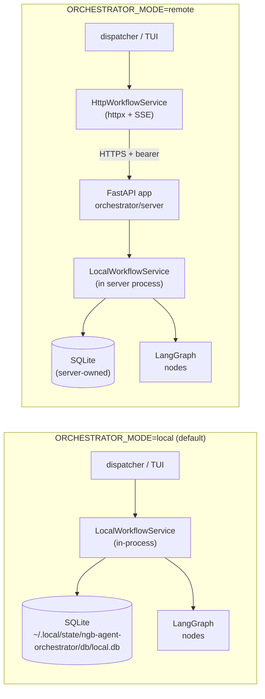

# Orchestrator HTTP Server

The orchestrator ships an optional FastAPI server that exposes the
[`WorkflowService`](architecture.md#orchestratorworkflow_service)
as REST endpoints, plus two Server-Sent Events (SSE) streams for
following workflow events and log output in real time. The CLI continues
to work against the in-process `LocalWorkflowService` and is **not**
affected by the server.

The `HttpWorkflowService` client (B3, AOS-143) routes the dispatcher
through this server when `ORCHESTRATOR_MODE=remote`. See
[docs/configuration.md](configuration.md#dispatcher--orchestrator-transport)
for the env-var contract.

---

## Local vs remote topology

The dispatcher always talks to a `WorkflowService` Protocol — the
transport is selected once at startup via `ORCHESTRATOR_MODE`. There are
no other code paths to flip.



The HTTP layer is a thin transport: every behaviour lives in
`LocalWorkflowService`, so the local and remote modes have identical
semantics for the operations they both expose.

---

## Running the server

There are four ways to run the server. They all boot the same FastAPI
app (`orchestrator/server/app.py`); pick the one that matches what you
are doing right now.

### When to use which

| Situation | Use | Lifetime |
|---|---|---|
| Quick debugging — want stdout in your face, will Ctrl-C when done | `orchestrator-server` | foreground; dies with terminal |
| Hot reload while editing server code | `uvicorn orchestrator.server.app:app --reload` | foreground; dies with terminal |
| Want it running in the background while you do other work | `orchestrator-server-ctl start` | detached; survives terminal close |
| Want it isolated (different Python, persistent volumes, prod-like) | `docker compose up` | container; survives terminal close |

### 1 — Foreground console script

```bash
# Install editable + deps once
.venv/bin/python -m pip install -e .
.venv/bin/python -m pip install -r requirements.txt

# Boot via console-script (reads ORCHESTRATOR_HOST/PORT/LOG_LEVEL/RELOAD)
orchestrator-server
```

`Ctrl-C` stops it. Closing the terminal stops it.

### 2 — Foreground uvicorn with `--reload`

```bash
uvicorn orchestrator.server.app:app --host 0.0.0.0 --port 8080 --reload
```

Restarts the server on file changes — useful when editing
`orchestrator/server/` itself.

### 3 — Detached background process (recommended for local dev)

The repo ships a thin Bash wrapper at
[`bin/orchestrator-server-ctl`](../bin/orchestrator-server-ctl) that
runs the console script under `nohup` + `disown`, so the server
survives the terminal that launched it (the spawned process is
reparented to PID 1). `bin/` is placed on `$PATH` by `.envrc`, so any
direnv-allowed shell can call the helper bare:

```bash
orchestrator-server-ctl start          # start detached; ~5s readiness probe
orchestrator-server-ctl status         # pid, bind, /healthz state
orchestrator-server-ctl logs           # tail the server log
orchestrator-server-ctl logs -f        # follow it
orchestrator-server-ctl restart
orchestrator-server-ctl stop           # SIGTERM, then SIGKILL after 10s
```

Runtime files live in `.run/` at the repo root (gitignored):

| File | Purpose |
|---|---|
| `.run/orchestrator-server.pid` | PID of the detached server |
| `.run/orchestrator-server.log` | Combined stdout + stderr |

The helper honours the same `ORCHESTRATOR_HOST` / `ORCHESTRATOR_PORT`
env vars as `orchestrator-server` itself (probe target is rewritten to
`127.0.0.1` when bound to `0.0.0.0`). Override `ORCHESTRATOR_RUN_DIR`
to relocate the pid/log directory.

### 4 — Container

See [Running with Docker](#running-with-docker) below.

### `orchestrator-server` vs `orchestrator-server-ctl`

They live at different layers:

- **`orchestrator-server`** is the Python console script (registered by
    `pip install -e .` via [`pyproject.toml`](../pyproject.toml)) that
    invokes `orchestrator.server.app:run()` and boots uvicorn in the
    **foreground**. This is the actual server binary.
- **`orchestrator-server-ctl`** is a Bash lifecycle wrapper around it
    (`start` / `stop` / `restart` / `status` / `logs`). It ultimately
    spawns the same `orchestrator-server` binary — it just detaches the
    process, tracks the PID, captures logs, and adds an idempotency
    guard so a second `start` doesn't spawn a duplicate.

Once running:

- Liveness: `GET http://localhost:8080/healthz`
- OpenAPI schema: `GET http://localhost:8080/openapi.json`
- Swagger UI: `GET http://localhost:8080/docs`

---

## Running with Docker

The repo ships a multi-stage `Dockerfile` (Python 3.12-slim, non-root
`orchestrator` user, default `CMD ["orchestrator-server"]`,
`HEALTHCHECK` against `/healthz`) and a `docker-compose.yml` that
bind-mounts the host's XDG state directory into the container so the
local CLI and the containerised server share one SQLite DB and one
per-workflow logs tree.

The host directory is `${XDG_STATE_HOME:-$HOME/.local/state}/ngb-agent-orchestrator`.
It is mounted into the container at
`/home/orchestrator/.local/state/ngb-agent-orchestrator`, which is exactly
where the in-container code resolves its XDG default. No `DB_PATH` or
`LOGS_DIR` overrides are needed.

> **Linux note:** the container runs as UID 1001. Files created under the
> bind-mounted directory inherit that ownership. On macOS / Podman this is
> remapped automatically by the VM's user namespace.

### Quick start with compose

```bash
docker compose up --build       # build + run in the foreground
docker compose up -d            # detached
docker compose logs -f orchestrator
docker compose down             # stop (host state dir persists)
```

The compose file reads `.env` from the project root, so the same secret
material that powers local CLI runs (Key Vault output, GitHub App, etc.)
applies to the containerised server.

> If your `.env` still defines `DB_PATH` or `LOGS_DIR` from earlier setups,
> remove them so the in-container code resolves the shared XDG path.

### Bare `docker run`

```bash
docker build -t ngb-orchestrator:dev .
docker run --rm -p 8080:8080 \
    --env-file .env \
    -v "${XDG_STATE_HOME:-$HOME/.local/state}/ngb-agent-orchestrator:/home/orchestrator/.local/state/ngb-agent-orchestrator" \
    ngb-orchestrator:dev
```

### Layout inside the image

| Path | Purpose |
|---|---|
| `/home/orchestrator/.local/state/ngb-agent-orchestrator/db/local.db` | SQLite DB — bind-mount the host XDG state dir here to persist runs and share state with the host CLI |
| `/home/orchestrator/.local/state/ngb-agent-orchestrator/logs/<workflow_id>/` | Per-workflow `workflow.log`, token usage, and `otel.jsonl` |
| `/app/config/` | Read-only config baked into the image (recipes and the WorkPlan schema ship inside the installed `orchestrator` package) |
| `/usr/local/bin/orchestrator-server` | Console script (the default `CMD`) |

### Smoke test

```bash
curl http://localhost:8080/healthz
# → {"status":"ok"}
```

### Pointing the dispatcher at it

```bash
export ORCHESTRATOR_MODE=remote
export ORCHESTRATOR_URL=http://localhost:8080
# export ORCHESTRATOR_TOKEN=<bearer>   # if ORCHESTRATOR_API_TOKEN is set on the server

dispatcher --list
```

The read / cancel / start / `read_logs` / `stream_events` surface works
end-to-end. Approval, clarification, retry, and PR-comment commands are
not yet exposed over HTTP — fall back to `ORCHESTRATOR_MODE=local` for
those.

---

## Endpoints

All `/workflows*` routes require a bearer token when
`ORCHESTRATOR_API_TOKEN` is set; see [Auth](#auth-stub) below.

| Method | Path | Purpose |
|---|---|---|
| `GET` | `/healthz` | Liveness probe — always 200, never auth-gated |
| `POST` | `/workflows` | Start a new workflow from a JIRA ticket |
| `GET` | `/workflows` | List workflows (optionally filter by `ticket_key`, `status`, `limit`) |
| `GET` | `/workflows/{id}` | Fetch a full workflow record |
| `POST` | `/workflows/{id}/cancel` | Cancel an in-flight workflow |
| `POST` | `/workflows/{id}/approve-plan` | Approve a paused WorkPlan and resume |
| `POST` | `/workflows/{id}/reject-plan` | Reject a paused WorkPlan and resume |
| `POST` | `/workflows/{id}/clarification` | Submit clarification answers and resume |
| `POST` | `/workflows/{id}/retry` | Retry a failed / interrupted workflow |
| `POST` | `/workflows/{id}/approve-pr` | Approve the workflow's PR and mark COMPLETED |
| `POST` | `/workflows/{id}/reject-pr` | Reject the workflow's PR and mark REJECTED |
| `POST` | `/workflows/{id}/comment-pr` | Post review comments on the PR and resume |
| `GET` | `/workflows/{id}/history` | Return the node traversal history |
| `GET` | `/workflows/{id}/audit-log` | Return the audit log entries |
| `GET` | `/workflows/{id}/events` | **SSE** — stream workflow lifecycle events |
| `GET` | `/workflows/{id}/logs` | **SSE** — stream captured workflow log content |
| `POST` | `/admin/clear-db` | **Admin** — wipe all workflows + checkpoints |
| `POST` | `/admin/workflows/{id}/mark-interrupted` | **Admin** — mark in-flight workflow FAILED |

Mutating routes that drive the LangGraph state machine are now
**fire-and-forget**: they enqueue the work on the server's
`BackgroundDispatcher` and return `202 Accepted` immediately with a
snapshot of the workflow row. The client follows the actual lifecycle
via `GET /workflows/{id}/events` (SSE). See
[Fire-and-forget mutations](#fire-and-forget-mutations) below.

Mutating routes return `404` when the workflow id is unknown and `409`
when the workflow is in an incompatible state for that action (e.g.
`retry` against a non-retryable workflow), or when the background
dispatcher already has an in-flight job for that workflow. Admin routes
have a stricter auth posture — see [Admin endpoints](#admin-endpoints)
below.

### Fire-and-forget mutations

The following routes are non-blocking: they return `202 Accepted` with a
`WorkflowRunResponse` snapshot, queue the graph drive on the
`BackgroundDispatcher` thread pool (size: `ORCHESTRATOR_BACKGROUND_WORKERS`,
default `4`), and the worker thread updates the workflow row as the
graph progresses.

- `POST /workflows`
- `POST /workflows/{id}/approve-plan`
- `POST /workflows/{id}/reject-plan`
- `POST /workflows/{id}/clarification`
- `POST /workflows/{id}/retry`
- `POST /workflows/{id}/approve-pr`
- `POST /workflows/{id}/reject-pr`
- `POST /workflows/{id}/comment-pr`

At most one job per workflow id may be in flight; a second submission
while one is already queued returns `409 Conflict`. If the worker
thread raises, the dispatcher transitions the workflow to `FAILED`
with the actor recorded as `background-dispatcher`.

Clients should subscribe to `GET /workflows/{id}/events` after
submitting to observe `node_start` / `node_end` / `interrupt` /
`completed` / `failed` / `cancelled` events. The dispatcher CLI does
this automatically (see `--detach` in [docs/workflows.md](workflows.md)
to opt out).

### `POST /workflows`

```json
{
    "ticket_key": "AOS-141",
    "dry_run": false,
    "workflow_id": null
}
```

Returns `202 Accepted` with a `WorkflowRunResponse` snapshot (workflow
id, current status, empty execution summary). The graph drive runs on
the background dispatcher; subscribe to
`GET /workflows/{id}/events` to observe the lifecycle.

### `GET /workflows`

Query parameters:

- `ticket_key` — filter to one ticket
- `status` — one of the `WorkflowStatus` values (`pending`, `in_progress`,
    `pending_approval`, `completed`, …). Unknown values return `400`.
- `limit` — 1..500 (default 50)

### `GET /workflows/{id}`

Returns the full `WorkflowDetailResponse` (work plan, execution summary,
clarification history, usage summary, retry count). `404` when unknown.

### `POST /workflows/{id}/cancel`

Optional JSON body:

```json
{
    "reason": "operator request",
    "actor": "ops-bot"
}
```

Returns:

- `204 No Content` on success
- `404 Not Found` when the workflow id does not exist
- `409 Conflict` when the workflow is already terminal

### Approval / clarification / retry

All four routes are fire-and-forget and return a `WorkflowRunResponse`
snapshot on `202 Accepted`, `404` when the workflow id is unknown, and
`409` when the workflow is in an incompatible state for the action (or
when another job is already in flight for the same workflow). The
actual graph drive runs on the background dispatcher — watch the
event stream to observe completion.

| Route | Body |
|---|---|
| `POST /workflows/{id}/approve-plan` | – |
| `POST /workflows/{id}/reject-plan` | `{"reason": "optional"}` |
| `POST /workflows/{id}/clarification` | `{"answers": [{"concern": "...", "answer": "..."}, ...]}` |
| `POST /workflows/{id}/retry` | – |

`concern` text in clarification answers must be non-empty; an empty list
of answers is allowed but the server will surface whatever the
underlying graph state requires.

### PR review flow

Same response/error shape as the approval routes.

| Route | Body |
|---|---|
| `POST /workflows/{id}/approve-pr` | – |
| `POST /workflows/{id}/reject-pr` | `{"reason": "optional"}` |
| `POST /workflows/{id}/comment-pr` | `{"comments": "non-empty review text"}` |

### `GET /workflows/{id}/history`

Returns the node traversal history, oldest first. Each entry has:

```json
{
    "step": 3,
    "node": "generate_code",
    "outcome": "ok",
    "result_keys": ["execution_summary"],
    "error": null
}
```

`outcome` is one of `ok`, `error`, `interrupted`. `404` when the
workflow id is unknown.

### `GET /workflows/{id}/audit-log`

Returns the audit log entries for the workflow, oldest first:

```json
{
    "workflow_id": "wf-1",
    "actor": "dispatcher",
    "action": "status_change",
    "timestamp": "2026-06-22T00:00:00",
    "details": {"to": "pending_approval"}
}
```

`404` when the workflow id is unknown.

### `GET /workflows/{id}/events` (SSE)

Live stream of workflow lifecycle events derived from LangGraph state
history. The response uses the standard SSE wire format
(`text/event-stream`) and one event per JSON payload:

```
id: 4
data: {"seq": 4, "kind": "node_end", "node": "plan", "data": {"result_keys": ["work_plan"]}}

```

`kind` is one of `node_start`, `node_end`, `interrupt`, `failed`. When
the workflow reaches a terminal status the server emits a final
`stream_end` event and closes the connection:

```
data: {"seq": 12, "kind": "stream_end", "node": null, "data": {"final_status": "completed"}}
```

**Replay / reconnect** — clients can resume after a disconnect by passing
the last seen sequence number either:

- as the `after_seq` query parameter, or
- via the standard `Last-Event-ID` header (set automatically by browser
    `EventSource`).

The query parameter takes precedence when both are present.

Heartbeats (`: ping\n\n` SSE comment frames) are sent every 15s of idle
time so proxies do not close the connection.

`404 Not Found` is returned synchronously when the workflow id is
unknown — before the stream is opened.

### `GET /workflows/{id}/logs` (SSE)

Live stream of the captured workflow log. Each event carries a JSON payload
with the stream name, the byte offset of the chunk within `workflow.log`, and
the chunk content:

```
id: 1024
data: {"stage": "workflow", "offset": 0, "end_offset": 1024, "content": "..."}
```

Query parameters:

- `stage` — optional stream name. `workflow` is the canonical stream; when
    omitted, `workflow` is followed.
- `after_offset` — skip bytes already delivered. Can also be supplied via
    `Last-Event-ID`.

Same heartbeat (15s) and terminal-`stream_end`/close semantics as
`/events`. The trailing event has no `id:` and looks like:

```
data: {"stage": "workflow", "kind": "stream_end", "final_status": "completed"}
```

#### Consuming with `curl`

```bash
curl -N "http://localhost:8080/workflows/$WF_ID/events"
curl -N "http://localhost:8080/workflows/$WF_ID/logs?stage=workflow&after_offset=4096"
```

`-N` disables curl's output buffering so frames render immediately.

---

## Auth stub

Authentication is a **placeholder** intended for early environments. It
will be replaced by a production-grade scheme in a follow-up epic.

| `ORCHESTRATOR_API_TOKEN` | Behaviour |
|---|---|
| unset / empty | Auth disabled — every `/workflows*` request allowed; warning logged at startup |
| any non-empty value | `/workflows*` requires `Authorization: Bearer <token>` |

`/healthz` and OpenAPI endpoints are intentionally left open so load
balancers and tooling can probe the service without credentials.

## Admin endpoints

`/admin/*` routes (`clear-db`, `mark-interrupted`) follow a stricter
posture than the rest of the API. They are destructive enough that an
open development server must never expose them:

| `ORCHESTRATOR_API_TOKEN` | Behaviour for `/admin/*` |
|---|---|
| unset / empty | All admin routes return `503 Service Unavailable` — admin is **disabled**, not just unauthenticated |
| set, request has no/wrong `Authorization` header | `401 Unauthorized` |
| set, request carries matching `Bearer <token>` | Request proceeds |

In production, set `ORCHESTRATOR_API_TOKEN` to a value known only to
trusted operators. The dispatcher reads the same value from
`ORCHESTRATOR_API_TOKEN` (see
[docs/configuration.md](configuration.md#dispatcher--orchestrator-transport))
when running in `ORCHESTRATOR_MODE=remote`.

---

## OpenTelemetry

Per-request HTTP spans are emitted when
`opentelemetry-instrumentation-fastapi` is installed:

```bash
pip install opentelemetry-instrumentation-fastapi
```

The server boots normally when the package is missing — the
instrumentation step is best-effort and only logs an info-level skip.
All other workflow spans (`workflow.run`, `graph.node.<name>`,
`llm.call`, …) continue to be emitted by the service layer regardless of
the HTTP transport. See [docs/configuration.md](configuration.md#opentelemetry-day-0-tracing)
for the full span reference.

---

## Architecture

```
HTTP client
        │
        ▼
FastAPI app  (orchestrator/server/app.py)
        │   require_bearer_token  (auth.py)
        │   get_service           (deps.py)
        ▼
WorkflowService  (Protocol from orchestrator/workflow_service)
        │
        ▼
LocalWorkflowService  → SQLite + LangGraph
```

The HTTP layer never touches `state/`, `orchestrator.builder`, or
LangGraph directly. Every behavioural detail lives in
`LocalWorkflowService`, so swapping the implementation (e.g. to a remote
backend or a fake in tests) requires no route changes.
